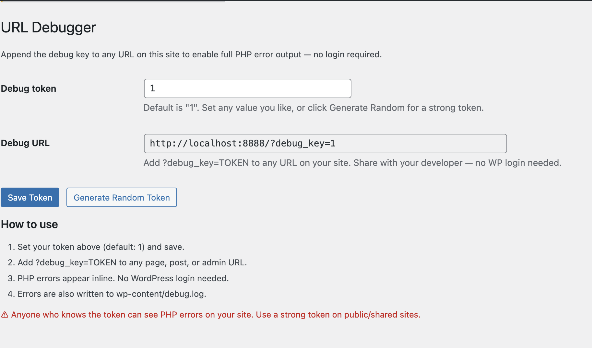
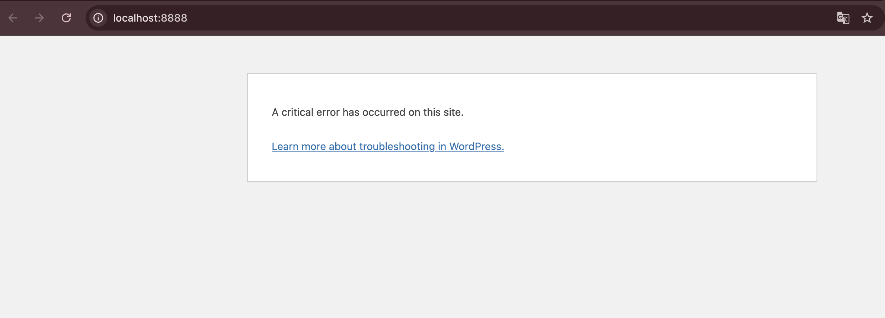

# URL Debugger

A WordPress plugin that enables PHP error output on any URL using a private secret token — no admin login required for your developer.

## How it works

1. Activate the plugin.
2. Go to **Settings → URL Debugger** and copy your secret token.
3. Append `?debug_key=YOUR_TOKEN` to any URL on your site.
4. PHP errors appear inline in the browser. Errors are also written to `wp-content/debug.log`.
5. Regenerate the token any time from the settings page.

## Screenshots

*Settings page — set or generate your debug token and copy the ready-to-share debug URL.*

*Without the debug key: WordPress shows only the generic "A critical error has occurred" message.*

*With `?debug_key=TOKEN` appended: the actual PHP error is revealed inline.*

## Installation

1. Download or clone this repo into `wp-content/plugins/url-debugger/`.
2. Activate via **Plugins → Installed Plugins**.
3. Go to **Settings → URL Debugger** to find your debug URL.

## Security

- The token is a randomly generated 48-character hex string stored in the database.
- Only someone who knows the token can enable debug mode — it is never exposed publicly.
- Regenerate the token instantly if it is ever leaked.
- Use a strong random token on any public or shared site.

## Requirements

- WordPress 5.0+
- PHP 7.4+

## License

[GPL-2.0-or-later](https://www.gnu.org/licenses/gpl-2.0.html)
